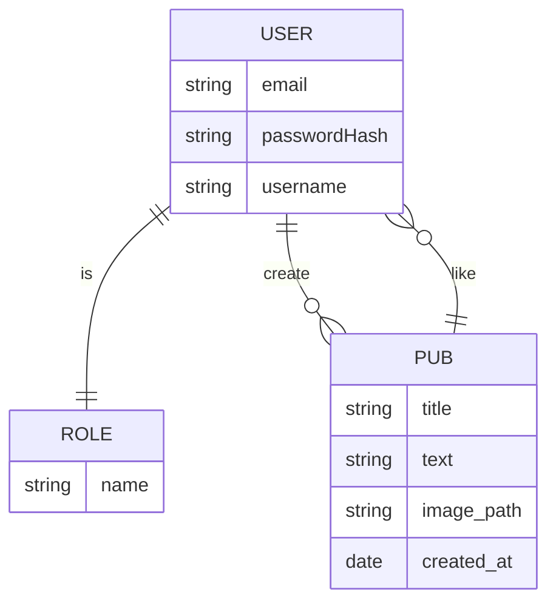

# Social App backend

## Install

```bash
npm install
```

## Start the server

* development:

```bash
npm run dev
```

* production:

```bash
npm run prod
```
  
* test:

```bash
npm run test
```

## Stack

* Fastify
* MongoDB with Mongoose

## Database

example


